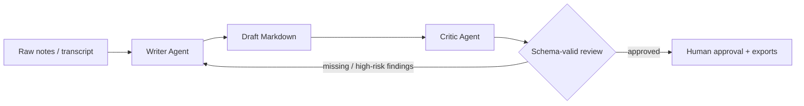

# Aureview AI

### Agentic Document Review System for Professional Services

Aureview AI turns rough requirements, meeting notes, contract facts, or compliance evidence into polished professional documents. A dedicated **Writer Agent** drafts against a strict standard; a separate **Critic Agent** returns structured findings and routes incomplete drafts back for automatic refinement before a human makes the final decision.

Built for the Project 2 brief: professional-services document creation, rubric-driven QA, agentic revision routing, and deployable web delivery.

## What Ships

| Experience | Capability |
| --- | --- |
| Animated landing page | Product narrative, agent workflow visualization, and conversion paths |
| Guest studio | Three daily reviewed generations without registration, live editing, Markdown download |
| Authentication | Secure password hashing and JWT-based private workspaces |
| Dashboard | Document status counts, average agent cycles, and recent activity |
| Document workspace | Formatting toolbar, Markdown edit/preview, saved drafts, Critic re-review and refinement |
| Export center | Download authenticated documents as `.docx`, `.md`, `.html`, or structured `.json` |
| Agent API | FastAPI REST service with strict schemas and provider-safe error handling |
| Terminal workflow | Generate and review a document directly through the `aureview` CLI |
| Deployment | Docker Compose production bundle plus standard local developer workflow |

## The Agent Loop



The orchestration is implemented with **LangGraph** state and conditional edges. Every template carries required headings. The Critic's output is validated as JSON (`status`, `score`, `findings`, `missing_sections`, `strengths`) before it can drive routing. Revisions are bounded to protect cost and latency.

## Document Standards

- **Product Requirements Document:** goals, success metrics, stories, requirements, UX flow, technical considerations, risks, rollout, open questions.
- **Compliance Review Memo:** scope, controls, evidence, findings, risk, remediation, sign-off.
- **Contract Review Brief:** parties, commercial terms, obligations, risk clauses, negotiation positions, missing information, next steps.
- **Consulting Decision Memo:** context, challenge, analysis, options, recommendation, roadmap, KPIs and risks.

Generated content is a drafting aid, not legal or compliance advice. Final approval remains explicitly human.

## Technology

| Layer | Stack |
| --- | --- |
| Frontend | React 19, TypeScript, Vite, Framer Motion, React Markdown |
| API | Python, FastAPI, Pydantic, SQLAlchemy |
| Agents | LangGraph Writer/Critic graph with structured review state |
| Persistence and auth | SQLite by default, Argon2 password hashing, JWT access tokens |
| AI providers | Built-in demo engine, OpenAI, Anthropic Claude, xAI Grok |
| Hosting | Nginx frontend container and Uvicorn API container |

## Project Layout

```text
AIDocWriter/
|-- backend/
|   |-- app/
|   |   |-- routers/            # Auth, public/guest, and owned document endpoints
|   |   |-- llm.py              # Demo/OpenAI/Anthropic/xAI provider adapters
|   |   |-- workflow.py         # LangGraph Writer <-> Critic routing
|   |   |-- templates.py        # Professional document rubrics
|   |   `-- main.py             # FastAPI application
|   |-- tests/test_api.py
|   `-- Dockerfile
|-- frontend/
|   |-- src/components/         # Composer, editor, review, shells, animation
|   |-- src/pages/              # Landing, auth, guest studio, dashboard, workspace
|   `-- Dockerfile
|-- .env.example
`-- docker-compose.yml
```

## Run Locally

### 1. Configure

From PowerShell in the project root:

```powershell
Copy-Item .env.example .env
```

The application works immediately with `DEFAULT_PROVIDER=demo`, without a model API key.

### 2. Start the API

```powershell
cd backend
python -m venv .venv
.\.venv\Scripts\Activate.ps1
python -m pip install -e ".[test]"
python -m uvicorn app.main:app --reload --port 8000
```

FastAPI documentation is available at [http://localhost:8000/docs](http://localhost:8000/docs).

### 3. Start the web application

In another PowerShell window:

```powershell
cd frontend
npm install
npm run dev
```

Open [http://localhost:5173](http://localhost:5173).

### 4. Run from the terminal

After installing the backend:

```powershell
aureview generate "Build a customer onboarding portal with document verification, audit logs, accessibility, and a target of completing onboarding in 30 minutes." --template prd --output onboarding-prd.md
```

Provider examples:

```powershell
aureview generate "Quarterly access review notes..." --template compliance --provider demo
aureview generate "New analytics SaaS vendor contract..." --template contract --provider xai --model grok-4.3
```

Cloud provider commands require the corresponding server environment key.

## Model Configuration

Only the backend reads credentials. Do not expose model keys in Vite environment variables or frontend code.

```dotenv
DEFAULT_PROVIDER=demo
DEFAULT_MODEL=studio-demo

OPENAI_API_KEY=
OPENAI_MODEL=gpt-4o

ANTHROPIC_API_KEY=
ANTHROPIC_MODEL=claude-3-5-sonnet-latest

XAI_API_KEY=
XAI_MODEL=grok-4.3
```

### About Grok / xAI Cost

The xAI API is supported through its OpenAI-compatible API endpoint. It should **not** be assumed free simply because a key can be created. As verified on **May 27, 2026**, xAI documents token-based API pricing and lists Grok API models on its pricing page. Availability and account-specific limits may vary.

- [xAI API pricing](https://docs.x.ai/developers/pricing)
- [xAI models](https://docs.x.ai/docs/models/)
- [xAI rate limits and OpenAI-compatible endpoint example](https://docs.x.ai/docs/key-information/consumption-and-rate-limits)

Use the built-in demo engine for zero-key demonstrations, UI evaluation, and tests. Use a configured cloud model when genuine model-generated prose and analysis are required.

## API Summary

| Method | Route | Purpose |
| --- | --- | --- |
| `GET` | `/api/health` | Runtime health check |
| `GET` | `/api/public/templates` | Template definitions |
| `GET` | `/api/public/providers` | Available/configured providers |
| `POST` | `/api/public/generate` | Rate-limited guest Writer/Critic generation |
| `POST` | `/api/auth/signup` | Create workspace account |
| `POST` | `/api/auth/signin` | Obtain JWT access token |
| `GET` | `/api/documents/dashboard` | Workspace operational summary |
| `POST` | `/api/documents/generate` | Generate and persist reviewed document |
| `PATCH` | `/api/documents/{id}` | Save live editor revisions |
| `POST` | `/api/documents/{id}/review` | Critique and auto-refine edited document |
| `GET` | `/api/documents/{id}/export/{type}` | Export `docx`, `md`, `html`, or `json` |

## Reliability and Edge Cases

- Source material is treated as untrusted document content in prompts, reducing prompt-injection risk from pasted text.
- Required headings are checked locally even when a cloud Critic is used; a missing mandatory section forces revision.
- Critic responses must parse into typed JSON before routing.
- Revision loops have a strict maximum iteration count.
- Guest access is limited daily by a hashed session/IP fingerprint.
- Provider credentials remain server-side; unconfigured providers are visibly disabled in the UI.
- API failures return useful errors instead of silently presenting unreviewed text as approved.
- HTML export is sanitized before download; protected documents are owner-scoped.
- Edits mark a stored document as requiring review until the Critic is rerun.

For production handling of confidential client material, replace SQLite with an operationally managed database, set a strong `SECRET_KEY`, terminate TLS, define retention policies, log approvals appropriately, and complete your provider/privacy assessment.

## Test and Build

API test suite:

```powershell
cd backend
.\.venv\Scripts\Activate.ps1
pytest
```

Frontend type-check and optimized static build:

```powershell
cd frontend
npm run build
```

Tests cover the health/configuration contract, signup and authenticated generation, editing and automatic reviewer refinement, DOCX export, the LangGraph revision route, and the guest quota.

## Deploy with Docker

Create a production `.env` first. At minimum, replace `SECRET_KEY`; add provider credentials only where needed.

```powershell
docker compose up --build -d
```

Open [http://localhost:8080](http://localhost:8080). The Nginx frontend proxies `/api` to the FastAPI service, and a named Docker volume preserves the SQLite database. For multi-instance cloud deployment, use PostgreSQL and a managed secret store rather than a local SQLite volume.

## Product Roadmap

- Template administration and organization-specific rubric versions.
- Approval trails, comments, and role-based reviewer permissions.
- Retrieval of approved policy libraries with citation grounding.
- Version comparison and redline exports.
- PostgreSQL, object storage, SSO, audit-event streaming, and observability for enterprise hosting.

---

**Aureview AI**: professional drafting accelerated by agents, accountable through human review.
