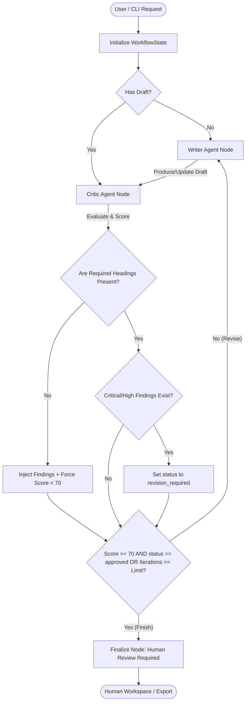

# Aureview AI - Full Project Overview and Technical Documentation

Aureview AI is an **Agentic Document Review System** tailored for professional services. It automates the process of transforming raw transcripts, unstructured requirements, or contract details into polished, standardized professional documents (such as PRDs, compliance memos, contract briefs, or decision memos). 

Rather than relying on single-shot LLM prompts, Aureview AI runs a multi-agent workflow orchestrated by **LangGraph**: a **Writer Agent** drafts or refines content, while a **Critic Agent** evaluates the draft against structured rubrics, routing the document back for revision if deficiencies or high-severity risks are found. 

---

## 🛠️ The Technology Stack

Aureview AI is built on a modern, robust, and deployable web stack:

### Frontend
- **Framework & Tooling**: [React 19](https://react.dev/), [Vite](https://vite.dev/), and [TypeScript](https://www.typescriptlang.org/).
- **Styling**: Sleek, custom-designed CSS with glassmorphism effects, a dark mode theme, grids, dynamic gradients, and smooth micro-animations.
- **Animations**: Powered by [Framer Motion](https://www.framer.com/motion/) for fluid page transitions, card hover highlights, and agent flow tracking.
- **Markdown Rendering**: [React Markdown](https://github.com/remarkjs/react-markdown) and `remark-gfm` for full rendering support of lists, tables, and bold/italic elements.
- **Icons**: [Lucide React](https://lucide.dev/) for cohesive UI iconography.

### Backend API
- **Framework**: [FastAPI](https://fastapi.tiangolo.com/) (Python 3.12+) exposing a structured REST API.
- **Validation**: Strict schema verification via [Pydantic](https://docs.pydantic.dev/).
- **Database ORM**: [SQLAlchemy 2.0](https://www.sqlalchemy.org/) mapping python database classes to SQL.
- **Database Engine**: [SQLite](https://www.sqlite.org/) by default (highly suitable for local runs), with full readiness to swap in PostgreSQL for staging/production.
- **Authentication**: JWT access tokens for session authorization, paired with secure password hashing using `pwdlib` (recommending Argon2/bcrypt).
- **Export Processors**:
  - **DOCX**: Programmatic Word Document construction via `python-docx`.
  - **HTML**: Custom compilation from Markdown to HTML using the Python `markdown` library, sanitized securely using `bleach`.

### Multi-Agent Orchestration
- **Workflow Engine**: [LangGraph](https://langchain-ai.github.io/langgraph/) to design state graphs with conditional routing and checkpoint memory persistence.
- **LLM Clients**: [LangChain](https://www.langchain.com/) wrappers supporting multiple providers:
  - **Demo Engine**: Offline fallback providing deterministic mocks for mock testing and UI inspection.
  - **OpenAI** (e.g., `gpt-4o`)
  - **Anthropic Claude** (e.g., `claude-3-5-sonnet-latest`)
  - **Groq** (e.g., `llama-3.3-70b-versatile`, `llama-3.1-8b-instant`, `gemma2-9b-it`)
  - **xAI Grok** (via OpenAI compatible adapters)

---

## 🔄 The Agent Workflow

The core value of Aureview AI is its multi-agent refinement loop. Instead of passing drafts directly to the user, the agent validates them programmatically:



1. **State Initialization**: The system parses the user's input notes and template choice. It sets up the [WorkflowState](file:///d:/AIDocWriter/backend/app/workflow.py#L14) dict containing input text, iteration count, provider settings, current draft, and agent trace history.
2. **Writer Agent**:
   - Prompts the model as an expert professional-services author.
   - Converts unstructured source materials into the structured markdown format requested by the template.
   - Highlights assumptions and parameters that need user check-off.
   - If revising, it receives the previous draft and the exact JSON critic feedback.
3. **Critic Agent**:
   - Evaluates the draft as a strict quality control inspector.
   - Inspects completeness, risk details, logical clarity, and section consistency.
   - Programmatically enforces structural presence: the agent uses a regex-based lookup on the backend (e.g. `^## Section Name$`) to verify that all mandatory headings exist. If a heading is missing, it automatically appends a high-severity finding and caps the score below `70`.
   - Returns a structured schema ([ReviewResult](file:///d:/AIDocWriter/backend/app/schemas.py#L55)) containing: `status` (`approved` or `revision_required`), `score` (0-100), `summary`, `missing_sections`, `findings` (list of defects with severity, issue, and recommendation), and `strengths`.
4. **Conditional Routing**:
   - If the Critic returns `revision_required` or a score below `70`, and the loop has not exceeded the maximum iteration count (default: 3, maximum: 4), the graph loops back to the Writer node.
   - Otherwise, the graph routes to the `finalize` node and halts, awaiting human action.

---

## 🌟 Key Product Features

### 1. Animated Landing Page
Located at [LandingPage.tsx](file:///d:/AIDocWriter/frontend/src/pages/LandingPage.tsx), this marketing portal includes:
- Animated feature grids.
- A live-interactive mock terminal workspace visualizing the Writer $\to$ Critic $\to$ Human review flow.
- Direct links to try the tool instantly or sign up for a persistent workspace.

### 2. Guest Studio
Located at [GuestStudioPage.tsx](file:///d:/AIDocWriter/frontend/src/pages/GuestStudioPage.tsx), it allows visitors to experiment with Aureview AI without authentication.
- Limits usage to 3 generations per day, tracked by hashed IP and browser-fingerprints on the server.
- Allows choice of templates (PRD, compliance, contract, or consulting briefs).
- Supports offline `demo` model execution or real cloud providers if configured.
- Shows live output, agent stages log, and allows downloading the generated document directly.

### 3. User Dashboard
Located at [DashboardPage.tsx](file:///d:/AIDocWriter/frontend/src/pages/DashboardPage.tsx), it serves as the hub for registered users:
- Displays summary statistics: Total Documents, Approved Documents, Needs Attention, and Average Agent Cycles.
- Displays recent activity history.
- Allows deleting and opening saved drafts.

### 4. Interactive Workspace
Located at [DocumentPage.tsx](file:///d:/AIDocWriter/frontend/src/pages/DocumentPage.tsx), this features a full-fledged IDE interface for drafting and QA:
- **Formatting Toolbar**: Rich shortcuts inside the [MarkdownEditor](file:///d:/AIDocWriter/frontend/src/components/MarkdownEditor.tsx#L14) component for **bolding**, *italicizing*, inserting headings (`## `), lists (`- `), quotes (`> `), and markdown tables (`| Column | Detail |`).
- **Dual Mode Editor**: Instant toggle between high-fidelity Markdown editing and GFM Preview.
- **Review Panel Sidebar**: The [ReviewPanel](file:///d:/AIDocWriter/frontend/src/components/ReviewPanel.tsx#L11) component displays:
  - An animated circular gauge highlighting the Critic's score (green for approved, orange/red for review-required).
  - Status banner showing approval state.
  - Complete list of Critic findings sorted by severity (Critical, High, Medium, Low), outlining what the issue is and recommending how to fix it.
  - Bulleted list of verified strengths.
  - Full audit trace logs of how many agent cycles ran and the scores achieved at each iteration.
- **Manual Overrides**: Authoritative options to mark the document as approved or run a fresh critic assessment.

### 5. Custom Document Template Builder
- In addition to standard templates (Product Requirements Document, Compliance Review Memo, Contract Review Brief, and Consulting Decision Memo), users can select the **Custom Document** option.
- Lets users specify a custom document name and a comma-separated list of required sections. The Critic Agent dynamically parses these inputs and validates them in the feedback loop.

### 6. Export Center
Users can export finalized documents into multiple professional formats:
- **Markdown (`.md`)**: Direct markdown text.
- **Word Document (`.docx`)**: Programmatically constructed MS Word file with headings and bullet lists.
- **HTML (`.html`)**: Sanitized, responsive web layout with inline style templates.
- **JSON (`.json`)**: Raw metadata dump including inputs, full document text, and Critic review logs.

### 7. Terminal CLI Workflow
Located at [cli.py](file:///d:/AIDocWriter/backend/app/cli.py), Aureview AI can be run directly from the CLI:
- Commands can be run via `aureview generate "notes..." --template prd --output my-doc.md`.
- Renders the generated document formatted inside the terminal using `rich.markdown`.
- Prints details on reviewer status, final score, and number of iterations.

---

## 🔒 Security, Robustness & Edge Cases

Aureview AI ensures production reliability through several layers:
- **Prompt Injection Prevention**: User inputs are nested inside strict XML tags (e.g., `<source>...</source>`) during prompts. The model is specifically instructed to treat this content as data, never as prompt instructions.
- **Strict Structured Outputs**: External model review requests are routed through LangChain's structured parser using Pydantic schema targets. If the model output fails to parse, it retries and triggers provider error codes rather than passing garbage logs.
- **Heading Safeguards**: The backend runs standard Python regular expressions to detect missing sections. If a required section is missing, the API overrides any model outputs, forces `revision_required` status, drops the score below `70`, and appends a high-priority finding to resolve the issue.
- **Guest Rate-Limiter**: Hashed fingerprints (combining IP client headers, guest session tokens, and the backend secret key) are checked daily against SQLite records to restrict abuse.
- **Workspace Data Isolation**: Documents are bound to users via foreign keys (`user_id`). Users can only query, edit, export, or delete documents they own.

---

## 📁 Codebase Directory Structure

```text
AIDocWriter/
├── .env.example                # Template for server credentials
├── docker-compose.yml          # Container configuration for production builds
├── deployment_guide.md         # Deployment configurations (Local/Docker/Render/Vercel)
├── red.txt                     # System workspace tracker
│
├── backend/                    # Python API and Multi-Agent Engine
│   ├── pyproject.toml          # Package manager and script installer definition
│   ├── app/
│   │   ├── __init__.py
│   │   ├── main.py             # FastAPI entrypoint, middleware, CORS, routing registration
│   │   ├── config.py           # Configuration parser for env vars using Pydantic Settings
│   │   ├── database.py         # DB connection setup and migration column validation
│   │   ├── models.py           # DB classes (User, Document, GuestUsage)
│   │   ├── security.py         # Password hashing (Argon2) and JWT token validation
│   │   ├── schemas.py          # Pydantic input/output schemas
│   │   ├── templates.py        # Static configurations and rubrics for doc standards
│   │   ├── prompts.py          # Prompt templates for Writer and Critic agents
│   │   ├── llm.py              # LLM clients, adapters, and local Demo engine mock
│   │   ├── workflow.py         # LangGraph graph builder (orchestration flow)
│   │   ├── serializers.py      # Serializers for transforming DB models to schemas
│   │   ├── cli.py              # Typer-based terminal generator
│   │   └── routers/
│   │       ├── auth.py         # Signup/Signin endpoints
│   │       ├── public.py       # Rate-limited templates, providers, and guest drafting
│   │       └── documents.py    # Authenticated document CRUD, review, and exporters
│   └── tests/
│       └── test_api.py         # Pytest suite covering auth, guest limits, edits, and loops
│
└── frontend/                   # React 19 Frontend Web App
    ├── package.json
    ├── vite.config.ts
    ├── src/
    │   ├── main.tsx            # React bootstrap entrypoint
    │   ├── App.tsx             # React router paths and protected route gates
    │   ├── api.ts              # API client functions and export downloads
    │   ├── auth.tsx            # Context provider for login states
    │   ├── types.ts            # TypeScript interfaces matching backend models
    │   ├── styles.css          # Styled themes, dark-mode CSS tokens, animations
    │   ├── components/
    │   │   ├── AppShell.tsx    # Header panels and structural frames
    │   │   ├── Backdrop.tsx    # Animated background mesh and auroral glowing spots
    │   │   ├── Brand.tsx       # Logo design
    │   │   ├── GenerationComposer.tsx  # Document builder inputs
    │   │   ├── MarkdownEditor.tsx      # Text editor, GFM preview, formatting toolbar
    │   │   └── ReviewPanel.tsx         # Sidebar displaying Critic scores, timeline, and findings
    │   └── pages/
    │       ├── LandingPage.tsx     # Animated landing page
    │       ├── AuthPage.tsx        # Secure signup/signin screens
    │       ├── GuestStudioPage.tsx # Registration-free playground
    │       ├── DashboardPage.tsx   # Authenticated document metrics and logs
    │       └── DocumentPage.tsx    # Full workspace screen
```

---

## 🚀 Deployment Guide

### 1. Developer Setup (Local Run)
To launch backend and frontend locally in developer mode:

1. **Configure Environment**:
   ```powershell
   Copy-Item .env.example .env
   ```
2. **Start the API Server**:
   ```powershell
   cd backend
   python -m venv .venv
   .\.venv\Scripts\Activate.ps1
   python -m pip install -e ".[test]"
   python -m uvicorn app.main:app --reload --port 8000
   ```
   *FastAPI docs are available at [http://localhost:8000/docs](http://localhost:8000/docs).*
3. **Start the React Frontend**:
   In a separate shell:
   ```powershell
   cd frontend
   npm install
   npm run dev
   ```
   *Vite dev server runs at [http://localhost:5173](http://localhost:5173).*

### 2. Run via Docker Compose
To build and package the services into Docker containers locally:
```powershell
docker compose up --build -d
```
*The combined system will be served behind Nginx at [http://localhost:8080](http://localhost:8080).*

### 3. Cloud Deployment (Render + Vercel)
For standard cloud deployments:
1. **Database**: Spin up a PostgreSQL DB instance on **Render**.
2. **Backend**: Deploy `/backend` directory on **Render** (Language: Python). Add environment variables: `DATABASE_URL` (Postgres url), `SECRET_KEY`, `CORS_ORIGINS`, and LLM keys (`OPENAI_API_KEY`, `ANTHROPIC_API_KEY`, or `GROQ_API_KEY`).
3. **Frontend**: Deploy `/frontend` directory on **Vercel** (Vite framework). Add environment variable `VITE_API_URL` pointing to your Render backend API URL (appended with `/api`).
4. **CORS Configuration**: Save your Vercel URL under `CORS_ORIGINS` in your Render backend settings to authorized secure resource access.
